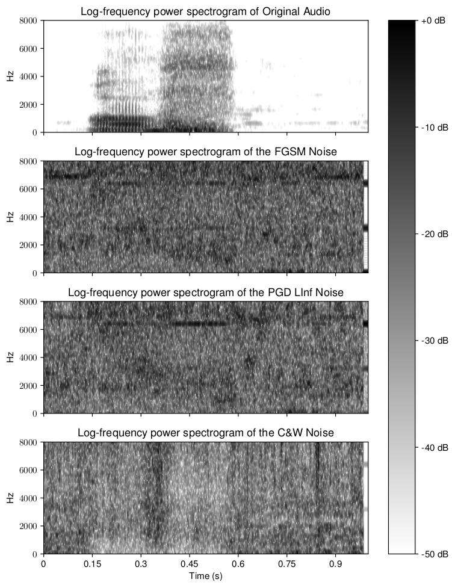
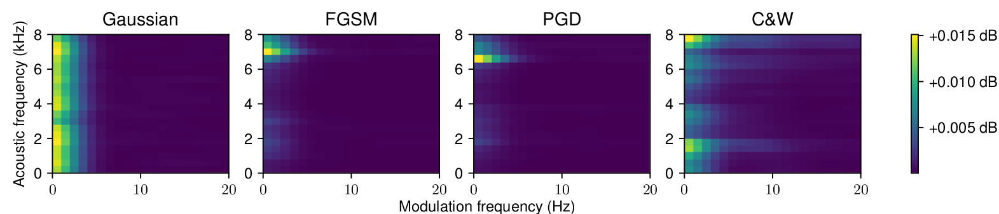

# A3D

Link to the full paper: [Click here](). [We will add as soon as the proceedings are available.]

**tl;dr**: This is an explorative work to understand the impact of white-box adversarial attacks on systems constructed on top of self-supervised speech representations.

## Cite

[We will add as soon as the proceedings are available.]

```latex
```

## Abstract

> Self-supervised speech pre-training has emerged as a useful tool to extract representations from speech that can be used across different tasks. While these models are starting to appear in commercial systems, their robustness to so-called adversarial attacks have yet to be fully characterized. This paper evaluates the vulnerability of three self-supervised speech representations (wav2vec 2.0, HuBERT and WavLM) to three white-box adversarial attacks under different signal-to-noise ratios (SNR). The study uses keyword spotting as a downstream task and shows that the models are very vulnerable to attacks, even at high SNRs. The paper also investigates the transferability of attacks between models and analyses the generated noise patterns in order to develop more effective defence mechanisms. The modulation spectrum shows to be a potential tool for detection of adversarial attacks to speech systems.

## How to run

a3d was developed with a python-package structure. First, we need to clone the repository and install the package.
We recommend you use a virtual environment for this.

```bash
$ git clone https://github.com/Hguimaraes/A3D
$ cd A3D
$ python -m venv .venv
$ source .venv/bin/activate
$ pip install -e .
```

### Data

The dataset used in our experiments is the [Google Speech Commands v0.02](http://download.tensorflow.org/data/speech_commands_v0.02.tar.gz).
Here, you can proceed in two ways:

1. Skip this section and let the code download and extract the files for you
2. Download the files and place them manually

For the second option, you must download the tar.gz file and place it inside a folder called *speech_commands_v0.02*. When executing the training or evaluation pipelines, point to the path where the *speech_commands_v0.02* folder is.

### Run

First, you need to train the clean models. For instance, to train the model based on WavLM, execute the following commands from the project root (A3D):

```bash
$ cd recipes/train_kws_models
$ python train.py hparams/config_wavlm_kws.yaml --data_folder /folder_to_extract_gsc --annotation_folder /folder_to_save_csv_annotations
```

You can change the appropriate paths on your computer. This will generate the model checkpoints inside the folder *recipes/train_kws_models/logs/kws_baseline_wavlm*.

Next, you can execute the robustness evaluations in the folder *recipes/eval_robustness*. Here, you should look into the configuration file from *hparams/config_kws.yaml*.

In particular, if you are interested in running the transferability experiments, you may want to edit the following variables:

1. attacker_model_folder: path to the model used to generate the perturbations
2. victim_model_folder: path to the model to be attacked
3. attacker_encoder: encoder name
4. victim_encoder: encoder name

If you want to change the attack type, look for the variable **attack**.


Finally, to run from the project root (A3D):

```bash
$ cd recipes/eval_robustness
$ python eval_ks.py hparams/config_kws.yaml --data_folder /folder_to_extract_gsc --annotation_folder /folder_to_save_csv_annotations
```

## Results

In the paper we have a section describing in more details the results from our study. However, we just want to illustrate here some notes:

From the log-frequency power spectrogram, we can observe some specific patterns related to each attack. For the last 3 spectrograms, we isolated the noise and normalize to better visualize. 



> As can be seen, the three attacks generated more noise in regions without speech activity and the noise patterns differed for each attack method. For example, FGSM generated high-frequency artifacts around 7 kHz; these appear as horizontal lines in the spectrogram. We attribute this pattern to the nature of the attack, which uses the sign of the model gradient, a high-frequency signal due to the sign-function changes. Down-sampling techniques have been studied in the audio domain as a potential defense mechanism against adversarial attacks~\cite{hussain2021waveguard}, with promising results in mitigating the attack patterns discussed. The PGD attack also exhibits this pattern. However, since the method is iterative, the patterns appear as more smooth in the spectrogram. Finally, the C&W attack is considerably distinct from the others. The noise pattern is similar to a white noise distribution without a clear pattern, thus more challenging to differentiate from an environmental perturbation and, potentially, more difficult to detect.

We also investigate the usage of a frequency-frequency representation called [modulation spectrum]() as shown in the next figure. The modulation spectrum is an established technique that successfully captures the temporal dynamics of speech spectral components and has shown to separate signal from noise components more reliably.



> Figure 2 depicts the modulation spectrogram for the Gaussian noise and the three adversarial attacks. As can be seen, for the FGSM and PGD attacks, modulation energy is concentrated in the high acoustic frequency range of modulation spectrogram and at modulation frequencies below 5 Hz. This representation also shows the similarities between the C\&W and Gaussian noise patterns across the acoustics frequency dimension, thus corroborating our findings from the conventional spectrogram. The frequency-frequency representation, however, shows some difference along the modulation frequency dimension (x-axis), thus suggesting a better representation for attack detection.
